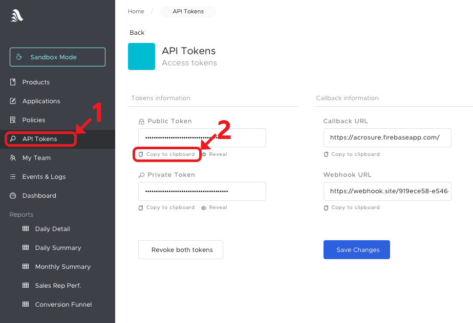

# เริ่มต้นใช้งาน {{id:getting-started}}

> การใช้งาน API Token คือการส่งไปใน Header ของ HTTP Request รูปแบบดังนี้:

```
Authorization: Bearer <YOUR_PUBLIC_TOKEN>
```

> ซึ่งตัวอย่างภายใน Documentation นี้ จะมีการส่ง API Token ไปด้วยทุกครั้ง ดังเช่นตัวอย่างด้านล่างนี้

```shell
curl -X POST \
  --header "Authorization: Bearer <YOUR_PUBLIC_TOKEN>" \
  --header "Content-Type: application/json" \
  https://api.acrosure.com/products/list;
```

```javascript
import AcrosureClient from "@acrosure/js-sdk";

const client = new AcrosureClient({ token: "<YOUR_PUBLIC_TOKEN>" });
const response = await client.product.list();
```

```java
import com.acrosure.Acrosure;
import com.acrosure.resource.Product;

public class Main {
  public static void main(String[] args) {
    Acrosure client = new Acrosure("<YOUR_PUBLIC_TOKEN>")
    Product[] products = client.product().list();
  }
}
```

```python
acrosure_client = AcrosureClient(token = '<YOUR_PUBLIC_TOKEN>')
products = acrosure_client.product.list(query)
```

```csharp
// CSharp Code
```

```swift
let client = AcrosureClient(token: "<YOUR_PUBLIC_TOKEN>")
client.product.list() { response in
  // ...
}
```

```php
$acrosureClient = new AcrosureClient([ "token" => "<YOUR_PUBLIC_TOKEN>" ]);
$products = $acrosureClient->getProductManager()->getList(query);
```

> ตัวอย่างผลลัพธ์จากคำสั่งด้านบน

```json
{
  "status": "ok",
  "data": [
    {
      "id": "prod_ta",
      ...
    }, {
      "id": "prod_motor",
      ...
    }
  ]
}
```

> ซึ่งผลลัพธ์ดังกล่าวก็คือรายการประกันภัยที่คุณสามารถทดลองใช้งานได้

ท่านสามารถเริ่มสมัครใช้งาน Acrosure เพื่อเริ่มทดลองเชื่อมต่อกับ Acrosure ได้อย่างง่ายๆ ดังนี้

1. ลงทะเบียนสร้าง Account Acrosure <a href="https://dashboard.acrosure.com/signup" target="_blank">ได้ที่นี่</a>

2. Login เข้าสู่ Dashboard <a href="https://dashboard.acrosure.com/login" target="_blank">ได้ที่นี่</a>

3. Copy API Token มาใช้
   
4. สามารถเริ่มทดลองเชื่อมต่อกับระบบ Sandbox ได้ทันที

<aside class="notice">
Secret Token สามารถใช้งานได้ทุก API ที่ Public Token สามารถเรียกได้ แต่ Secret Token มีไว้ใช้ใน Server เท่านั้น
</aside>
